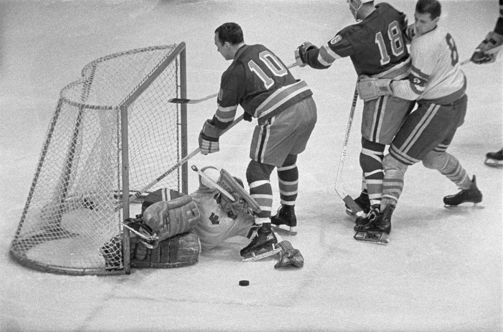

# CTF d'intégration de Securimag, 02-10-2025

## Auteur: Laurent Mercier.

## Challenge: Echoes on Ice.

### Catégorie: OSINT.

#### Énoncé

```
I found an old photo at my grandparents' house and I would like to find out its history...

Can you find the following information from this image?

    Date of the match
    City where it took place
    Winner of the match (in English)
    First and last name of the photographer

The flag is in the following format (case insensitive):
Securimag{dd-mm-yyyy_city_winner_firstname_lastname}
```

#### Writeup

On vous donne une photo de joueurs de hockey en noir et blanc et on vous demande la date, la ville où a eu lieu le match, l'équipe gagnante du match et le prénom et nom du photographe.  

Voici la photo en question:   

À première vue, cette photo semble assez âgée et on peut penser qu'il serait difficile de la trouver sur Internet. On pourrait essayer de découvrir quelles équipes font partie du match en regardant les jerseys des joueurs, mais à part pour le gardien, les joueurs sont de dos à la caméra. J'ai donc essayé le truc le plus simple quand on me donne une photo à identifier, Google Reverse Image Search. En y insérant la photo, on obtient plusieurs correspondances exactes, et on peut sélectionner n'importe laquelle, mais j'ai choisi de prendre celle de Wikimedia car on y trouve généralement toutes les informations nécessaires sur la photo.  

Voici le lien de la photo: [Wikimedia](https://commons.wikimedia.org/wiki/File:Olympische_spelen_ijshockey_Zweden_tegen_Amerika,_Bestanddeelnr_921-0653.jpg)  

En regardant les informations de la photo (et en les traduisant), on découvre que la photo a été prise le 7 février 1968, lors d'un match de hockey olympique entre la Suède et les États-Unis, par un certain Ron Kroon de l'agence ANEFO. En recherchant "Hockey jeux olympiques 1968" sur votre naviguateur préféré, vous tomberez sur la page Wikipedia du hockey aux jeux olympiques de 1968: [Wikipedia](https://en.wikipedia.org/wiki/Ice_hockey_at_the_1968_Winter_Olympics). On y trouve donc que les jeux olympiques se sont déroulés à Grenoble en 1968, et en cherchant à travers les matchs (ctrl-f Sweden ou bien ctrl-f USA), on découvre que les États-Unis ont affronté la Suède à une seule reprise lors de ces jeux olympiques, et que le résultat du match était de 4 à 3 pour la Suède. Avec toutes ces informations, on peut maintenant soumettre le flag!  

Le flag est donc: `Securimag{07-02-1968_Grenoble_Sweden_Ron_Kroon}`.  

**INCORRECT**  

Mais que s'est-il passé? Pourquoi le flag ne marche pas? Après quelques essais infructueux, j'ai fini par réaliser que Ron Kroon n'était pas le bon nom. En allant sur la page Wikipedia de Ron Kroon ([Wikipedia](https://en.wikipedia.org/wiki/Ron_Kroon)), on découvre au premier mot que son prénom complet n'est pas Ron, mais bien Ronald.  

On peut donc entrer le flag à nouveau: `Securimag{07-02-1968_Grenoble_Sweden_Ronald_Kroon}`.  

**SUCCÈS**
