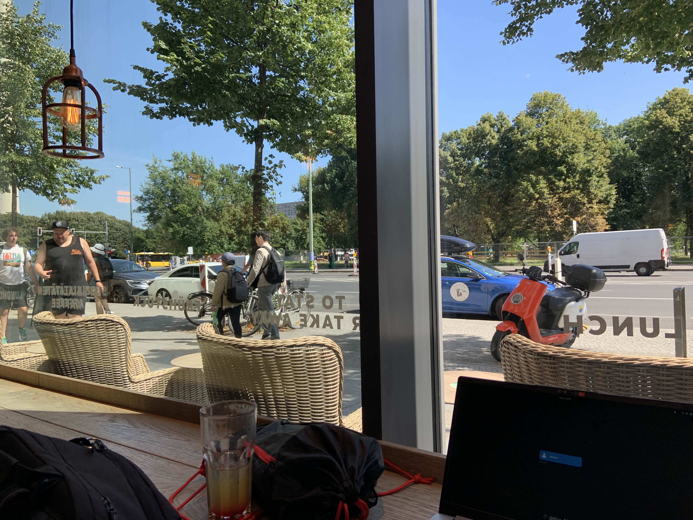
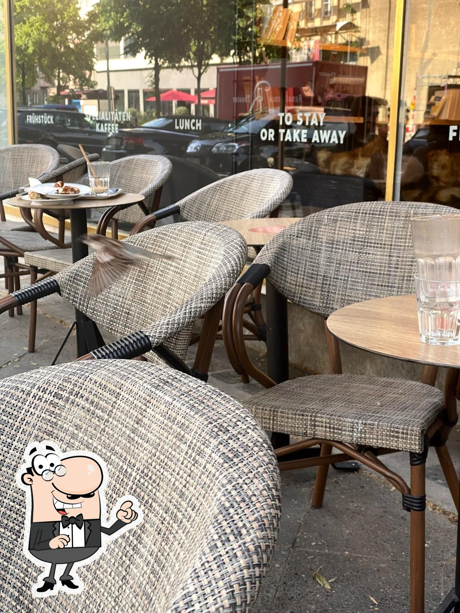
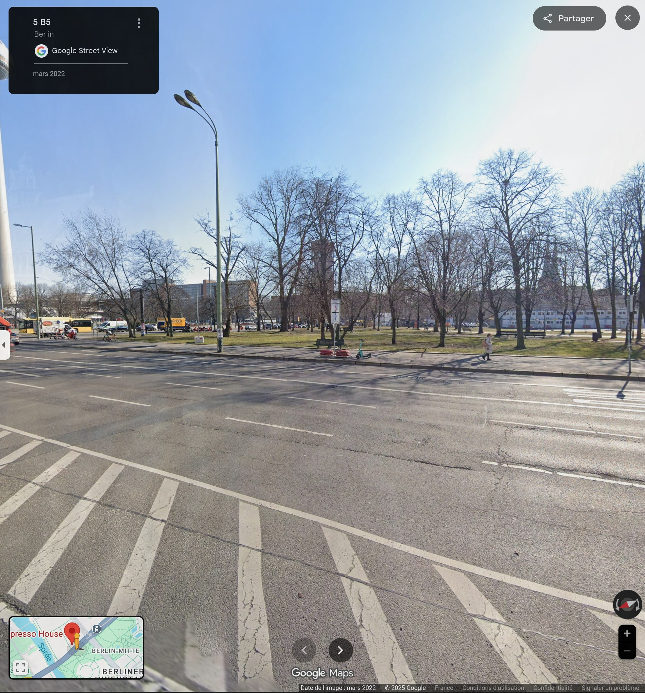

# CTF d'intégration de Securimag, 02-10-2025

## Auteur: Laurent Mercier.

## Challenge: whereami.

### Catégorie: OSINT.

#### Énoncé

```
You are given a single photo taken during my vacation. Hidden in this picture are the clues you need to investigate and identify where it was taken.

Your mission is to find:

    The name of the establishment
    The street
    The city

Every special characters like ",", ".", spaces etc. are replaced by "-". "-" stay as "-".

Once you have all the information, assemble it into the flag with the format:

Securimag{<establishment>_<street>_<city>}

```

#### Writeup

On vous donne une photo de ce qui semble être l'intérieur d'un café ou un restaurant, où l'on voit une petite terrasse dehors, une vitrine, un grand boulevard et un parc de l'autre côté de la rue.  

Voici la photo en question:   

Pour commencer, on peut passer la photo à travers Google Reverse Image Search, et on n'obtient pas de correspondance exacte, mais on obtient une photo assez similaire:   

On voit que les inscriptions dans la vitrine sont les mêmes que celle dans la photo à identifier, ce qui est encourageant! En regardant d'où vient la photo sur Google Reverse Image Search, on aperçoit qu'elle provient d'un site web donnant des avis sur des restaurants: [Restaurant Guru](https://fr.restaurantguru.com/Espresso-House-Berlin-5). On apprend donc que le nom du restaurant est Espresso House, sur la rue Knesebeckstraße à Berlin.  

On peut entrer le flag suivant: `Securimag{Espresso-House_Knesebeckstraße_Berlin}`.  

**INCORRECT**  

Il semble que ce ne soit pas le bon endroit. En effet, en faisant une recherche sur votre naviguateur préféré, on remarque que Espresso House est une chaîne et qu'il y en a beaucoup. Afin de limiter la recherche, on peut faire une recherche sur Google Maps des restaurants Espresso House en Allemagne seulement, puisque la vitrine de la photo à identifier contient des mots en allemand. Ensuite, on peut regarder les restaurants un par un afin d'identifier si c'est le bon restaurant ou non. Afin de faciliter la recherche, on peut sélectionner un restaurant et utiliser la fonction Google Street View afin de regarder à quoi ressemble l'environnement autour du restaurant et voir si c'est similaire à la photo à identifier ou non. On cherche un grand boulevard avec un parc en face. Après quelques minutes de recherche, je suis tombé sur le restaurant Espresso House qui se trouve à l'adresse suivante: Karl-Liebknecht-Str. 5, 10178 Berlin, Allemagne. Voici la vue d'en face du restaurant sur Google Street View:   

On peut voir un grand boulevard avec un parc en face, ce qui ressemble beaucoup à la photo à identifier. De plus, sur le côté gauche de la photo à identifier, on peut observer un genre de cylindre beige très grand. On voit ce même cylindre beige sur la vue de Google Street View, et c'est en fait la tour Fernsehturm de Berlin, ce qui nous confirme que c'est bel et bien le bon Espresso House cette fois-ci.  

On entre donc le flag à nouveau: `Securimag{Espresso-House_Karl-Liebknecht_Berlin}`.  

**INCORRECT**  

Encore incorrect? Il faut peut-être que le nom de la rue soit complet. En faisant une recherche de l'adresse du café sur un naviguateur, on obtient plusieurs résultats qui mentionnent cette adresse, mais cette fois-ci, dans sa forme complète: Karl-Liebknecht-Straße 5, 10178 Berlin. Il nous manquait donc le Straße à la fin.  


Finalement, le bon flag: `Securimag{Espresso-House_Karl-Liebknecht-Straße_Berlin}`.  

**SUCCÈS**
